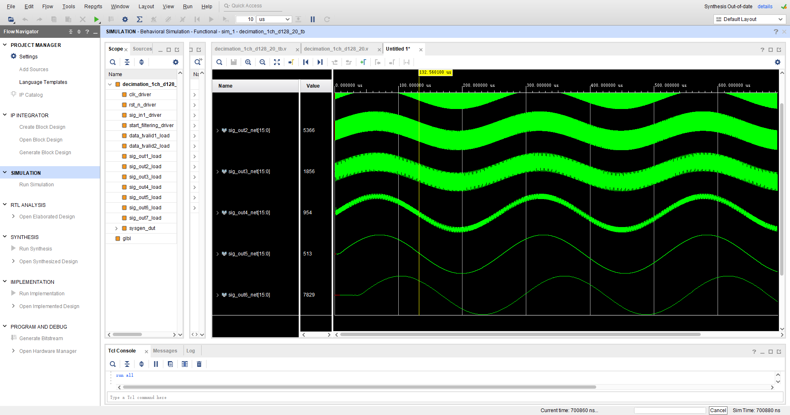
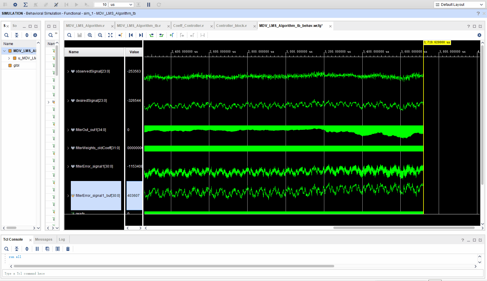

# 📦 decimation_adaptive

[](https://doi.org/)

**decimation_adaptive** implements a multi-rate signal processing system on FPGA, integrating:

1. **Decimation Filtering**
2. **Adaptive Correlation Cancellation Filtering (ACCF)**

The system targets **motion-induced electromagnetic noise suppression** in marine controlled-source electromagnetic (CSEM) methods, especially useful for deep-towed receiver arrays in complex ocean environments.


## 🛠 Environment & Tools

- **Vivado Design Suite 2020.2** : For FPGA design and simulation.
- **MATLAB R2020b **:
  MATLAB is utilized to visualize the output data generated by the testbench through graphical plotting. 


## 📉 Decimation Filtering

The decimation chain is designed as:

1 MHz →  (ADC_CIC)128 kHz → 64 kHz → 32 kHz → 16 kHz → 4 kHz → 2 kHz → 1 kHz

This enables:

- Relaxed requirements for analog anti-aliasing filters
- Reduced in-band quantization noise
- Improved SNR

Each stage uses carefully balanced filters:

- **CIC (Cascaded Integrator-Comb) Filters**: For high-rate coarse decimation
- **Half-Band and FIR Filters**: For precise filtering in lower-rate stages

SysGen is employed to model Verilog modules, with functional verification performed via hardware co-simulation. This structure is optimized for the **Xilinx XC7A200TFBG484-2 FPGA**, which offers ample DSP resources for high-throughput multi-rate processing.

The input and output data widths are both 16-bit signed.You can modify them as needed based on your requirements.




By cascading each filter stage, the final decimation filter is constructed. The time-domain response of the cascaded system, obtained using MATLAB, is shown in the **first figure below**, and the **zoomed-in view** (with a reduced time scale) is presented in the **second figure**.

The time-domain waveforms are arranged sequentially from top to bottom:

- **Left column**:
  1. Superimposed waveform consisting of 50 kHz and 10 Hz signals
  2. Output after **FIR_HB0** filtering
  3. Output after **FIR_HB1** filtering
  4. Output after **FIR_HB2** filtering
- **Right column**:
  5. Output after **FFIR0** filtering
  6. Output after **FFIR1** filtering
  7. Output after **FFIR2** filtering
  8. Final valid triggered signal after **128× decimation**


## 🔄Digital_To_Physical_Conversion

------

To convert a signed 16-bit digital value into a signed 24-bit fixed-point physical quantity (`sfix24_13`), one must first interpret the digital value as a real-world physical measurement. In the provided example, the output is voltage (V), but this should be adjusted according to the actual application scenario. For instance, if the target is electric field (V/m), the voltage should be divided by the receiver electrode spacing. For normalized electric field (V/(A·m²)), it must also be divided by the transmitter current and the relevant electrode geometry. Assuming a ±5 V reference and a signed 16-bit input, the conversion to physical voltage is:
 **out_physical= (in_digital/ 32768) × 5 V**


## 📈 Adaptive Filtering

The core of the system is a **closed-loop LMS-based Adaptive Correlation Cancellation Filter** that mitigates flow-induced and motion-induced noise in the received electromagnetic signals. This helps preserve the integrity of peak sequences, enhancing downstream large-scale EM imaging.

Key design considerations include:

- **Fixed-point arithmetic**: All weight updates and inner products are implemented with truncation and rounding to prevent bit width overflow and to retain meaningful precision.
- **FPGA-specific optimization**: Unlike CPU implementations, the hardware realization must manage pipeline timing, resource sharing, and word-length management explicitly.

Due to the highly dynamic nature of towed marine systems, the channel response (from motion, cable sway, sea current) changes rapidly. A fixed-step LMS algorithm often suffers from slow convergence or poor steady-state error.

We adopt a **LMS** algorithm, where the **Motion-Distance Variable Step-Size** is dynamically tuned based on:

- Acceleration and velocity measurements
- Signal energy accumulation
- Norm of the reference signal
- Estimated motion-induced channel variations

This allows:

- Fast initial convergence
- Improved robustness and stability in non-stationary environments
- Better real-time tracking of system dynamics

The input data type is signed fixed-point (sfix24_13), and the output data type is signed fixed-point (sfix31_13). You can modify them as needed based on your requirements.




In fact, the actual result corresponds to `filterError_signal1[30:0]` at each rising edge of `ready` when it is valid. The `filterError_signal1_buf[30:0]` is of `reg` type and is used to facilitate observation during simulation.

`plotVivadoTb.m` is used to plot the output results of the testbench. As shown in the figure below, it illustrates the adaptive filtering result for a sine signal with superimposed noise:


As shown in the figure below, it illustrates the adaptive filtering result for an actual CSEM signal with superimposed noise:


## 📌 Note

- **Compatibility:**
   Although most newer software versions maintain backward compatibility with older versions, it is recommended to choose the same software version as used in the "Environment & Tools" section. This minimizes potential hidden bugs caused by updates in IP core versions.
- **Architecture Design Considerations:**
   The architecture is specifically designed for the CSEM exploration scenario. In high-throughput real-time processing applications like Ground Penetrating Radar (GPR), it may be necessary to adjust the pipeline multipliers or specialized multiplier IP cores used across all projects to ensure that the system operates without metastability issues.
- **DSP Resource Consumption:**
   Pay attention to DSP resource usage, especially with multi-channel requirements. Modifications may be necessary, or a higher resource chip might need to be used depending on the complexity of the design.
- **Pin Constraints & Clock Constraints:**
   Ensure proper pin and clock constraints are applied. The module operates normally at a 50 MHz clock frequency.

## 📚 Directory Structure

```
├─decimation_adaptive_vivado
│  # Vivado's cache for various simulation and IP compilation results
│  ├─decimation_adaptive_vivado.cache
│  │  ├─wt                       # Working temporary files
│  │  ├─compile_simlib           # Precompiled simulation libraries
│  │  │  ├─activehdl             # Active-HDL specific compiled libs
│  │  │  ├─ies                   # Cadence IES simulator files
│  │  │  ├─modelsim              # ModelSim simulator files
│  │  │  ├─questa                # QuestaSim simulator files
│  │  │  ├─riviera               # Riviera-PRO simulator files
│  │  │  ├─vcs                   # Synopsys VCS simulator files
│  │  │  └─xcelium               # Cadence Xcelium simulator files
│  │  └─ip
│  │      └─2020.2              # Cached IP-specific files for Vivado 2020.2
│
│  ├─decimation_adaptive_vivado.hw      # Hardware design-related data
│
│  ├─decimation_adaptive_vivado.ip_user_files  # User-generated IP core files
│  │  ├─ip                            # All instantiated IP cores
│  │  │  ├─decimation_1ch_d128_20_fir_compiler_v7_2_i[0-6]  # FIR compiler IPs
│  │  │  └─clk_wiz_0                 # Clock wizard IP
│  │  ├─ipstatic                     # Static HDL files shared across IPs
│  │  │  └─hdl
│  │  ├─mem_init_files               # Memory initialization data
│  │  └─sim_scripts                  # Scripts to simulate each IP core
│  │      ├─decimation_1ch_d128_20_fir_compiler_v7_2_i[0-6]
│  │      │  ├─activehdl
│  │      │  ├─ies
│  │      │  ├─modelsim
│  │      │  ├─questa
│  │      │  ├─riviera
│  │      │  ├─vcs
│  │      │  ├─xcelium
│  │      │  └─xsim
│  │      └─clk_wiz_0               # Similar subfolders for simulation platforms
│
│  ├─decimation_adaptive_vivado.sim
│  │  └─sim_1 #Simulation Cache
│  │      └─behav
│  │          └─xsim
│  │              ├─xsim.dir
│  │              │  ├─MDV_LMS_Algorithm_tb_behav
│  │              │  │  ├─obj
│  │              │  │  └─webtalk
│  │              │  ├─xil_defaultlib
│  │              │  └─decimation_1ch_d128_20_tb_behav
│  │              │      ├─obj
│  │              │      └─webtalk
│  │              └─sin
│  ├─decimation_adaptive_vivado.srcs
│  │  ├─sim_1 #Testbench Simulation Code
│  │  │  └─new
│  │  └─sources_1 #Multirate Signal Processing and Adaptive Filter Code
│  │      ├─new                      # Custom-designed HDL modules
│  │      └─ip
│  │          ├─decimation_1ch_d128_20_fir_compiler_v7_2_i[0-6]
│  │          └─clk_wiz_0
│
│  ├─.Xil                            # Local Vivado session and log metadata
│  │  ├─Vivado-24144-DESKTOP-98774D5
│  │  └─Vivado-31420-DESKTOP-98774D5
│
│  ├─decimation_1ch_d128_20.gen      # Auto-generated files for each FIR compiler IP
│  │  └─sources_1
│  │      └─ip
│  │          ├─decimation_1ch_d128_20_fir_compiler_v7_2_i[0-6]
│  │          │  ├─cmodel            # C-model simulation files
│  │          │  ├─constraints       # Timing/placement constraints
│  │          │  ├─demo_tb           # Example testbenches
│  │          │  ├─doc               # IP documentation
│  │          │  ├─hdl               # HDL wrapper and netlist
│  │          │  ├─sim               # Simulation support files
│  │          │  └─synth             # Synthesized netlist and output
│  ├─decimation_adaptive_vivado.runs
│  │  ├─.jobs
│  │  ├─decimation_1ch_d128_20_fir_compiler_v7_2_i0_synth_1
│  │  │  └─.Xil
│  │  ├─decimation_1ch_d128_20_fir_compiler_v7_2_i1_synth_1
│  │  │  └─.Xil
│  │  ├─decimation_1ch_d128_20_fir_compiler_v7_2_i2_synth_1
│  │  │  └─.Xil
│  │  ├─decimation_1ch_d128_20_fir_compiler_v7_2_i3_synth_1
│  │  │  └─.Xil
│  │  ├─decimation_1ch_d128_20_fir_compiler_v7_2_i4_synth_1
│  │  │  └─.Xil
│  │  ├─decimation_1ch_d128_20_fir_compiler_v7_2_i5_synth_1
│  │  │  └─.Xil
│  │  ├─decimation_1ch_d128_20_fir_compiler_v7_2_i6_synth_1
│  │  │  └─.Xil
│  │  └─clk_wiz_0_synth_1
│  │      └─.Xil
│  └─decimation_adaptive_vivado.gen
│      └─sources_1
│          └─ip
│              └─clk_wiz_0
│                  └─doc
└─README
```


## 📝License

This project is licensed under the [GNU General Public License v3.0](https://www.gnu.org/licenses/gpl-3.0.html).


